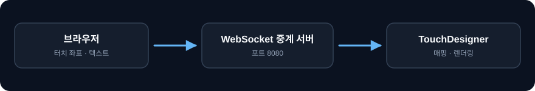

# TouchDesigner Web Bridge

> 휴대기기 브라우저의 터치 좌표와 텍스트 입력을 WebSocket으로 TouchDesigner에 전달합니다. 받은 값을 TouchDesigner에서 매핑해 비주얼과 인터랙션을 구성합니다.


브라우저는 **입력 장치**입니다. 화면을 누르면 좌표를, 입력창으로 텍스트를 보냅니다. 결과물은 TouchDesigner에서 만듭니다.

## 구조



한 포트에 양쪽이 접속하고, 서버는 받은 메시지를 보낸 쪽을 제외한 모든 접속자에게 전달합니다. 역할을 구분하지 않으므로 TouchDesigner도 브라우저와 같은 주소를 씁니다.

중계 자체는 양방향이지만, 이 저장소의 브라우저 화면은 보내는 쪽만 구현했습니다. 반대 방향은 [td-web-interaction](https://github.com/devmyungduk/td-web-interaction)에서 다루고, 포트와 메시지 형식이 같아 두 저장소의 중계 서버를 서로 바꿔 쓸 수 있습니다.

## 실행

Node.js 22 이상이 필요합니다. 없으면 [nodejs.org](https://nodejs.org/)에서 설치합니다.

```bash
git clone https://github.com/devmyungduk/touchdesigner-web-bridge.git
cd touchdesigner-web-bridge
npm install
npm run dev
```

`npm install` 한 번으로 클라이언트와 서버 의존성이 함께 설치되고, `npm run dev` 한 명령으로 둘 다 실행됩니다.

서버가 뜨면 접속 주소가 출력됩니다.

```
WebSocket 서버: ws://localhost:8080
같은 네트워크에서 접속할 주소:
  ws://192.168.0.10:8080   (웹 화면은 http://192.168.0.10:3000)
```

PC에서는 `http://localhost:3000`을 엽니다. 오른쪽 위 표시가 `연결됨`이면 준비된 상태입니다.

따로 실행하려면 `npm run dev:client`와 `npm run dev:server`를 씁니다.

## 휴대기기에서 접속

터미널에 출력된 `http://<주소>:3000`을 같은 공유기에 연결된 휴대기기에서 엽니다. 클라이언트가 **접속한 호스트로 WebSocket을 연결**하므로 코드나 설정을 고칠 필요가 없습니다.

연결되지 않으면 확인할 것이 두 가지입니다.

- PC와 휴대기기가 같은 네트워크에 있는지
- Windows 방화벽이 Node.js의 인바운드 연결을 허용하는지 (`3000`, `8080`)

## TouchDesigner 연결

[TouchDesigner](https://derivative.ca/download)는 비상업 용도 무료 버전이 있습니다.

1. **WebSocket DAT**를 추가합니다.
2. `Network Address`를 `localhost`, `Network Port`를 `8080`으로 설정합니다.
3. `Active`를 켭니다.

브라우저가 보내는 값은 WebSocket DAT의 콜백 DAT(`onReceiveText`)로 들어옵니다.

```json
{ "type": "click", "x": 512, "y": 300, "time": "14:23:05" }
{ "type": "text",  "content": "입력한 문자열", "time": "14:23:11" }
```

콜백에서 파싱해 원하는 파라미터에 연결합니다.

```python
import json

def onReceiveText(dat, rowIndex, message, bytes):
    data = json.loads(message)
    if data['type'] == 'click':
        op('constant1').par.value0 = data['x']
        op('constant1').par.value1 = data['y']
    elif data['type'] == 'text':
        op('text1').par.text = data['content']
    return
```

여기서부터는 TouchDesigner 작업입니다. 받은 좌표를 파티클 위치나 노이즈 시드로 쓰고, 텍스트를 Text TOP에 넣는 방식으로 확장합니다.

## 구성

```
package.json          루트. workspaces 로 client·server 를 함께 관리
client/
  app/page.tsx        입력 화면. 좌표·텍스트 전송과 전송 로그
  app/layout.tsx      폰트와 메타데이터
server/
  server.js           중계 서버
images/               스크린샷
```

Next.js 16 · React 19 · TypeScript · Tailwind CSS 4 · ws

## 설정

| 환경변수 | 기본값 | 용도 |
|---|---|---|
| `WS_PORT` | `8080` | 중계 서버가 열 포트 |
| `WS_VERBOSE` | 미설정 | `1`이면 중계한 메시지를 콘솔에 출력 |
| `NEXT_PUBLIC_WS_PORT` | `8080` | 브라우저가 접속할 포트 |
| `NEXT_PUBLIC_WS_URL` | 미설정 | 접속 주소를 직접 지정할 때. 설정하면 호스트 자동 감지를 대신합니다 |

포트를 바꾸려면 `WS_PORT`와 `NEXT_PUBLIC_WS_PORT`를 같은 값으로 맞춥니다.

## 문제 해결

| 증상 | 확인 |
|---|---|
| `연결 끊김`이 계속 표시됨 | 서버가 실행 중인지, 포트가 같은지 확인 |
| `EADDRINUSE` | 다른 프로세스가 `8080`을 쓰고 있음. `WS_PORT`를 바꾸거나 해당 프로세스를 종료 |
| 휴대기기에서 화면이 안 열림 | 같은 네트워크인지, 방화벽이 `3000`·`8080`을 막지 않는지 확인 |
| TouchDesigner가 값을 못 받음 | `WS_VERBOSE=1`로 서버를 띄워 중계가 일어나는지 확인. 서버까지 왔는지 TD에서 막혔는지 구분됨 |
| `Cannot find module 'ws'` | 루트에서 `npm install`을 실행했는지 확인 |

## 라이선스

이용 조건은 [LICENSE](LICENSE)를 확인하세요.

질문과 오류 제보는 Issues를 이용해 주세요.
